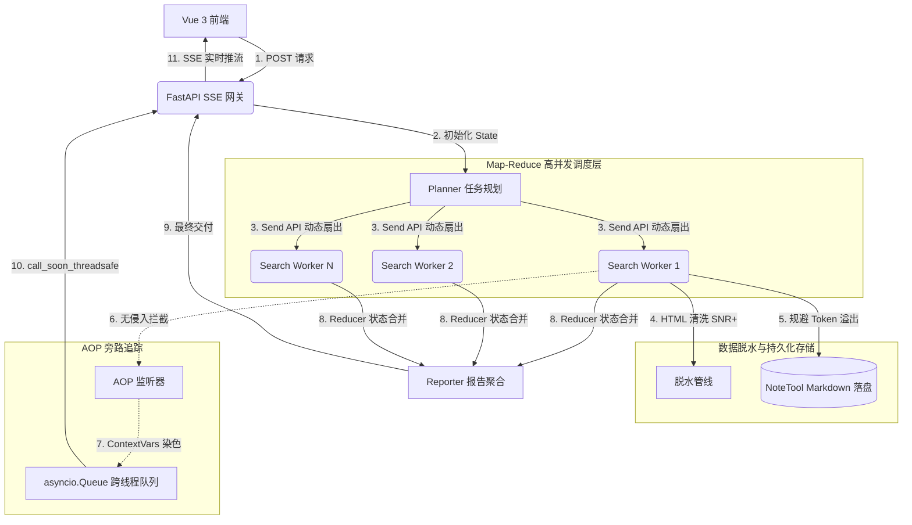

```markdown
# 🔍 Auto DeepSearch - 自动化深度研究多智能体系统1


> 基于 LangGraph + FastAPI 构建的企业级全自动深度网络调研平台。采用 Map-Reduce 并发工作流与异步非阻塞网关，实现从课题拆解、多源网络检索、数据脱水提纯，到最终研究报告 **Token 级打字机流式生成** 的完整闭环。

---

## 🚀 核心工程特性 (Core Engineering Features)

* ⚡️ **Map-Reduce 高并发工作流设计**
    * 应用 LangGraph 的 `Send` API 实现图状态的动态扇出（Fan-out），构建多子任务并行检索与归约架构。
    * 突破传统串行 Agent 的效率瓶颈，将单次深研的**平均耗时从 5 分钟缩短至 1 分钟以内**。
* 🌊 **高并发调度与全双工流式网关**
    * 基于 `asyncio.to_thread` 与跨线程队列（`asyncio.Queue`）构建底层的**“生产者-消费者”隔离模型**，彻底斩断同步爬虫与大模型推理对事件循环的物理阻塞。
    * 结合 FastAPI 搭建 POST+SSE 异步长连接网关，实现多 Worker 无阻塞调度与 **Token 级极低延迟**的打字机输出。
* 👁️ **AOP 透明化监控体系 (Tool Calling Tracing)**
    * 借助面向切面（AOP）编程思想挂载底层事件监听器，**无侵入式拦截**底层的工具调用过程。
    * 将 AI 的思考链路、检索参数与执行进度实时抽离并流式推送，破解 Agent 运行的“黑盒化”痛点，实现核心链路的前端可视化监控。
* 💾 **数据脱水管线与状态持久化**
    * 设计 HTML 网页文本清洗管线，精细化剥离 DOM 噪音与无效标签，大幅提升大模型输入的**信息密度（SNR）**，Token 消耗骤减 90%。
    * 开发 `NoteTool` 记忆工作区组件，引导大模型将中间推导结果 **Markdown 级物理落盘**，状态机纯指针化流转，赋予系统完备的**断点续传能力**并根治 Token 溢出风险。

---

## 🛠️ 技术栈 (Tech Stack)

| 层级 | 技术选型 | 核心工程角色 |
|:---|:---|:---|
| **后端框架** | FastAPI + Uvicorn | 异步高性能网关、SSE 流式事件推流 |
| **工作流引擎** | LangGraph | 多智能体图状态机状态编排、Map-Reduce 动态扇出 |
| **高并发组件** | Asyncio + ThreadPoolExecutor | 跨线程队列通信、物理线程池空间隔离（防阻塞） |
| **监控/治理** | ContextVars + AOP Listener | 跨线程上下文追踪染色、工具调用无侵入式拦截 |
| **数据脱水** | Trafilatura / BeautifulSoup | HTML 文本去噪、Markdown 格式亲和度映射 (SNR+) |
| **前端框架** | Vue 3 (Composition API) + TS | 组件化开发、SSE 客户端流式联调、打字机渲染 |

---

## 🏗️ 项目结构 (Project Structure)

```text
.
├── backend/                  # Python 后端服务
│   ├── src1/                 # 核心源码
│   │   ├── main.py           # FastAPI 入口、REST API、SSE 网关路由
│   │   ├── agent.py          # DeepResearchAgent 主控、LangGraph 拓扑图及条件边定义
│   │   ├── models.py         # 全局状态模型 (SummaryState 引入 Reducer 机制)
│   │   ├── config.py         # 线程池、并发水位、环境变量驱动配置
│   │   ├── prompts.py        # 包含 Tool Calling 负向硬约束的 Few-Shot 提示词模板
│   │   ├── tenacity.py       # 外部网络检索网络层指数退避重试策略
│   │   └── service/          
│   │       ├── planner.py    # 任务动态拆解与状态恢复重载服务
│   │       ├── search.py     # 多源搜索调度与反爬降级处理
│   │       ├── note.py       # NoteTool 记忆组件，控制 Markdown 级物理落盘
│   │       └── tool_events.py# AOP 监听器，基于 ContextVars 的跨线程调用追踪
│   ├── pyproject.toml        
│   └── .env                  # 环境变量配置
└── frontend/                 # Vue 3 前端工程
    ├── src/
    │   ├── components/       # UI 组件库
    │   │   ├── TaskList.vue  # 任务流可视化看板 (由 AOP 流式数据驱动)
    │   │   └── TaskDetail.vue# Token 级打字机报告渲染组件
    │   └── services/         
    │       └── api.ts        # Fetch SSE 流式客户端事件解析联调

```

---

## 🔄 研究工作流拓扑 (Workflow Topology)

系统内部基于 LangGraph 状态机实现无缝调度，其 Mermaid 拓扑图如下：



---

## 🔌 核心 API 接口与流式协议

### 1. 流式研究接口 (SSE)

* **路径**: `/research/stream`
* **方法**: `POST`
* **数据类型**: `text/event-stream`

**请求主体 (JSON):**

```json
{
  "topic": "2026年全球固态电池商业化落地进展与核心供应链阻碍分析",
  "search_api": "tavily"
}

```

**SSE 流式事件响应格式:**

```text
event: task_summary_chunk
data: {"types": "task_summary_chunk", "content": "固"}

event: task_summary_chunk
data: {"types": "task_summary_chunk", "content": "态"}

event: tool_call_event
data: {"agent": "SearchWorker_1", "tool": "GoogleSearch", "status": "running", "query": "固态电池电解质"}

```
## ⚙️ 系统配置 (.env)

在启动项目前，需在 `backend/` 目录下配置核心环境变量：

```env
# 大模型配置 (默认接入支持 Tool Calling 的基座模型)
OPENAI_API_KEY=sk-xxxxxxxxxxxxxxxxxxxxxxxxxx
LLM_MODEL=gpt-4o  # 或配置 Gemini API 等

# 检索引擎配置
TAVILY_API_KEY=tvly-xxxxxxxxxxxxxxxxxxxxxx

# 系统并发与调度水位
MAX_CONCURRENT_WORKERS=5          # Map 阶段最大并发 Worker 数量
THREAD_POOL_MAX_WORKERS=50        # 后端物理线程池总容量限制 (防 OOM)

# 持久化存储路径
WORKSPACE_DIR=./workspace/notes   # NoteTool 物理落盘根目录

```

---

---

## 🛠️ 快速开始

### 1. 后端冷启动

```bash
cd backend
# 使用新一代高效率包管理器 uv 进行单机同步
uv sync
# 配置环境变量
cp .env.example .env
# 启动 FastAPI 高性能网关
python -m uvicorn src1.main:app --host 0.0.0.0 --port 8000 --reload

```

### 2. 前端联调

```bash
cd frontend
npm install
npm run dev

```

访问 `http://localhost:5173` 即可进入可视化多智能体交互大厅。

---

## 📝 许可证

本项目基于 **MIT License** 开源。

---

*Developed with ❤️ by Cui Yongkang © 2026*

```

```
